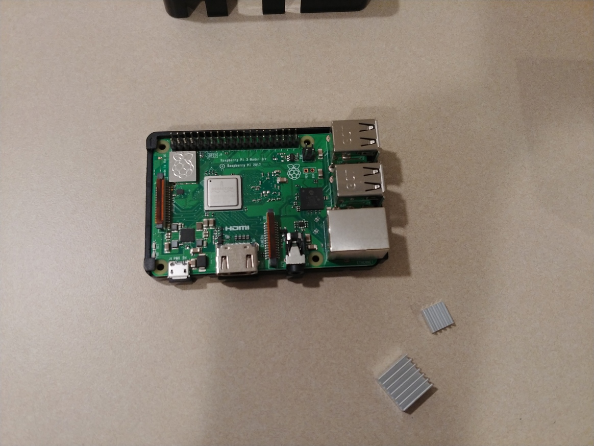
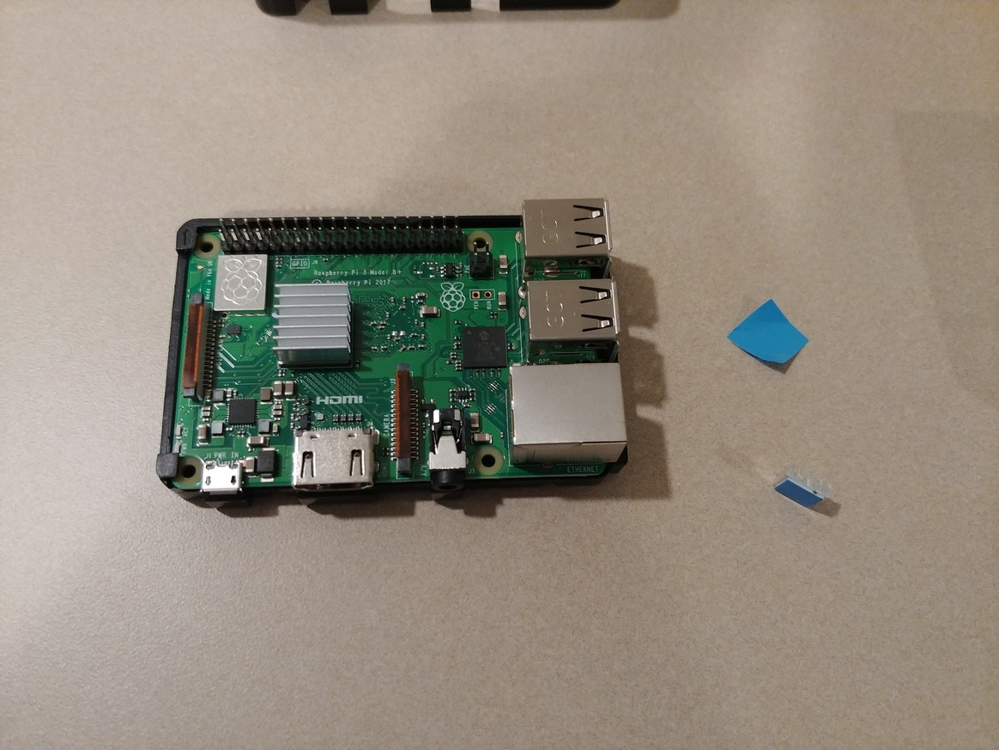
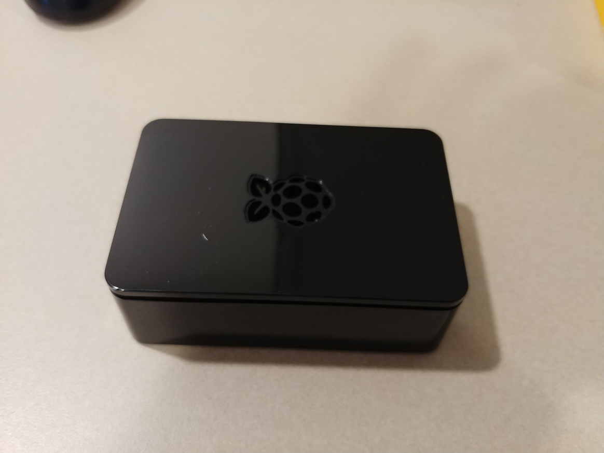
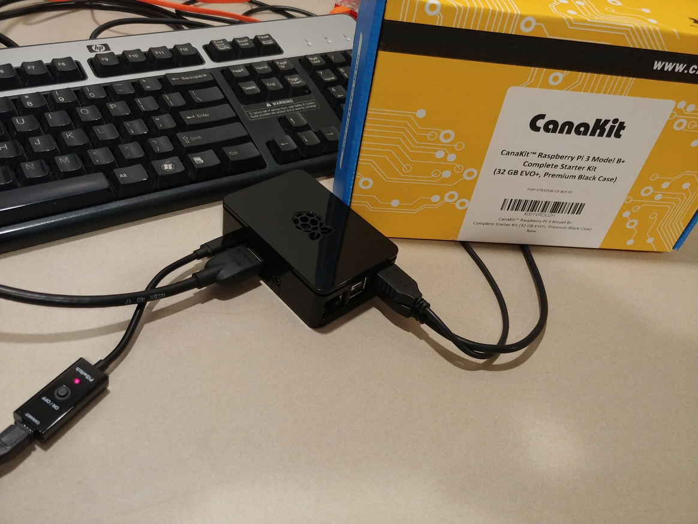
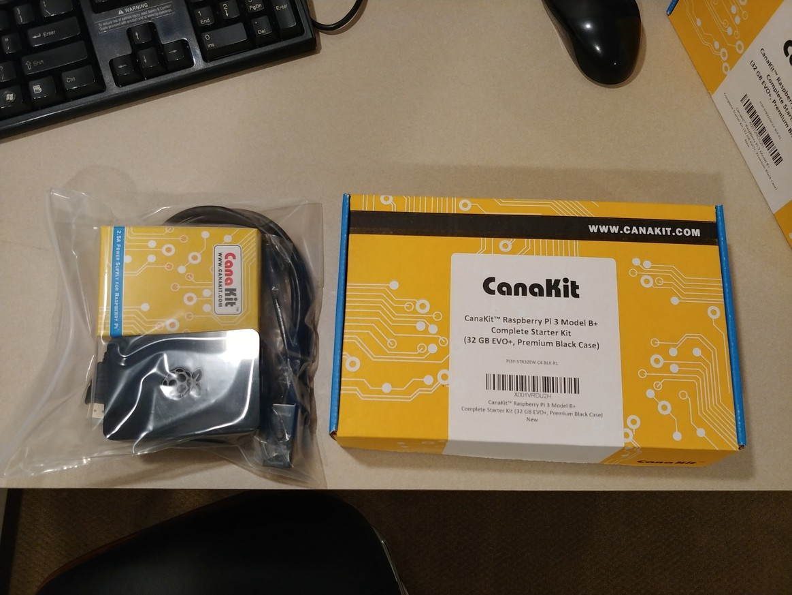

## Raspberry Pi
### Unboxing and Physical Setup
These instructions describe how to unbox and setup the CanaKit Raspberry Pi, without software installation. The goal is to get each kit setup and packaged into a zip-lock bag for compact transportation to Uganda.  All kits are unboxed and ready for transportation, go to [Operating System Setup](operating-system-setup-raspbian.md) next.

**Kit:** [CanaKit Raspberry Pi 3 B+ (B Plus) Starter Kit (32 GB EVO+ Edition, Premium Black Case)](https://www.amazon.com/dp/B07BCC8PK7)

_Bonus_: Make some KoC/Mwebaza sticker(s) to go on the outside of each RPi case!

----
##### Unboxed

----
##### Before Adding Heat Sinks

----
##### Heat Sink Installation Video

http://www.youtube.com/watch?v=Xg5n56x9Y7A

----
##### After 1st Heat Sink

----
##### After 2nd Heat Sink

----
##### Raspberry Pi Case Assembly

https://www.youtube.com/watch?v=ihfwSlBQ0VU

----
##### In case

----
##### Complete

----
##### Connected to USB keyboard/mouse, HDMI, and power

----
##### Components in bag
* Raspberry Pi in Case
  * Including 32GB card inserted into SD slot
* USB MicroSD Card Reader
* HDMI Cable
* PiSwitch (On/Off Power Switch for Raspberry Pi)
* Power supply (leave it in the power supply box, since the cord is messy)

After the kit is fully packaged in the zip-lock bag, the original boxes and manuals can be discarded.

